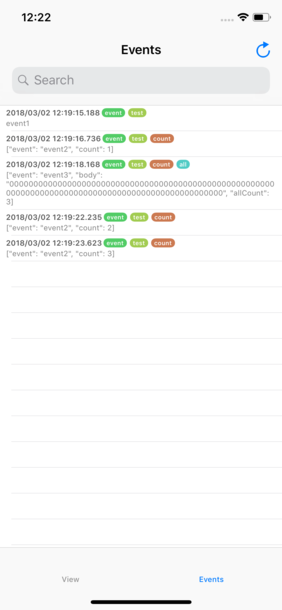

# EventBottle

[](https://travis-ci.org/slightair/EventBottle)
[](http://cocoapods.org/pods/EventBottle)
[](http://cocoapods.org/pods/EventBottle)
[](http://cocoapods.org/pods/EventBottle)

In app event log recorder/viewer for debugging.



## Usage

### Event recording

You can record events to use built-in `EventBottleFileEventDataStore`.

```swift
let eventDataStore = EventBottleFileEventDataStore.shared

eventDataStore.putEvent("event1", labels: ["activity", "test"])
eventDataStore.putEvent(["event": "event2", "count": 42], labels: ["activity", "test", "count"])
```

### Show recorded events

Create `EventBottleViewController` instance and present it.

If you want to look filtered events, input keyword (Partial Match) or label (Exact Match) to search field.

### Custom EventDataSource and EventDataStore

#### EventDataSource

The `EventDataSource` is data source of events for event log viewer.
The role of `EventDataSource` is produce some `Event` structs from File, DB, or other sources.

```swift
struct Event {
    let date: Date
    let labels: [String]
    let body: String
}
```

You can create custom event data sources using `EventDataSource` protocol.
If you know data structure of data sources and convert log to `Event` structure, you can show these events on `EventBottleViewController`.

```
let eventDataSource = CustomEventDataSource()
let viewController = EventBottleViewController(eventDataSource: eventDataSource)

present(viewController, animated: true) // in your application's secret!
```

#### EventDataStore

The `EventDataStore` is data store of your application event logs.
The role of `EventDataStore` is provide interface for storing events and store event logs to File, DB or other data stores.

You can create custom event data store using `EventDataStore` protocol.

## Requirements

- iOS 10+
- Swift 4

## Installation

### Carthage

```
github "slightair/EventBottle"
```

### CocoaPods

```
pod 'EventBottle'
```

## Author

Tomohiro Moro, arksutite@gmail.com

## License

EventBottle is available under the MIT license. See the LICENSE file for more info.
